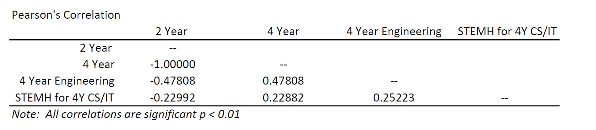
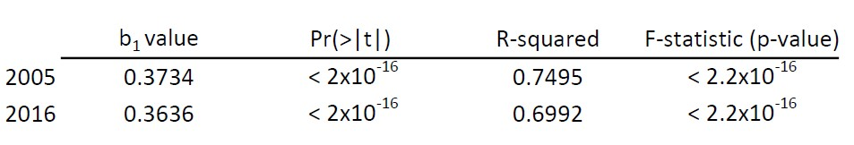
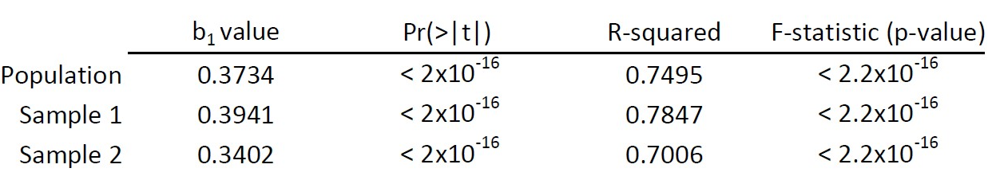

```{r setup, include=FALSE}
knitr::opts_chunk$set(echo = TRUE, message = FALSE, warning = FALSE)
```

## Problem Set 1 - Quantitative Analysis

Working in:  
C:-Users-Amy Richardson-Dropbox-VT - PhD-ENGE 5714 - Quant-R Practice-ENGE5714-Problem Set 2

GitHub [link](https://github.com/AmyRichardsonVT/ENGE5714/blob/main/Problem%20Set%202/ProblemSet2.Rmd) to Code

```{r}
library(car)
library(psych)
library(ggplot2)
library(tidyverse)
library(broom)
```

***
# ------Part 1------

Create a correlation table between %2Y All, %4Y All, %4EngTot4yr, and %CSSTEMH4yr.  In text, report which correlations are statistically significant (if any) and comment on the strength of any relationships you observe. Run parametric and non-parametric versions. 


Read in Data and Create a DataFrame of  salient columns.
```{r}
all_degrees <- read.csv("PS_Degrees.csv", header = TRUE)

names(all_degrees)[1] <- "div_name"
percent_degrees <- all_degrees %>%
  select("Div_num", "X.2r", "X.4yr", "X.EngTot4yr", "X.CSSTEMH4yr" ) %>%
  transform(X.2r = X.2r * 100) %>%
  transform(X.4yr = X.4yr * 100) %>%
  transform(X.EngTot4yr = X.EngTot4yr * 100) %>%
  transform(X.CSSTEMH4yr = X.CSSTEMH4yr * 100)
```

* Define variables:
     + X.2r = Percent of total degrees awarded from 2-yr public VA institutions, 2012-13 through 2016-17
     + X.4yr = Percent of total degrees awarded from 4-yr institutions, 2012-13 through 2016-17
     + X.EngTot4yr = Percent of total degrees from 4-yr institutions during five-year time period that were Engineering degrees
     + X.CSSTEMH4yr = Percent of all STEMH degrees awarded from 4-yr institutions that were CS/IS during five-year time period

Remove rows with NA since the entire row contains NA values
```{r}
percent_degrees <- percent_degrees[-c(135:144), ]
```

Check to see if the data is normally distributed.  First Plot this data.
```{r}
degree_df_long <- percent_degrees %>% 
  pivot_longer(cols = X.2r:X.CSSTEMH4yr, names_to = "Variable", values_to = "Percentages")

degree_df_long %>% 
  ggplot(aes(x = Percentages, fill = Variable)) +
  geom_histogram() +
  facet_wrap(Variable ~., scales = "free") +
  theme(legend.position = "none")


```

Run Q-QPlots
```{r}
degree_df_long %>% 
  ggplot(aes(sample=Percentages)) +
  stat_qq() +
  stat_qq_line() +
  facet_wrap(Variable ~ ., scales = "free")
```

Run correlation 
```{r}
my_correlations <- percent_degrees %>% select(X.2r, X.4yr, X.EngTot4yr, X.CSSTEMH4yr) %>% cor()
print(my_correlations)
```

Get p-values
```{r}
cor.test(percent_degrees$X.2r, percent_degrees$X.EngTot4yr)
```
```{r}
cor.test(percent_degrees$X.2r, percent_degrees$X.CSSTEMH4yr)
```
```{r}
cor.test(percent_degrees$X.4yr, percent_degrees$X.EngTot4yr)
```
```{r}
cor.test(percent_degrees$X.4yr, percent_degrees$X.CSSTEMH4yr)
```

```{r}
cor.test(percent_degrees$X.CSSTEM, percent_degrees$X.EngTot4yr)
```

Run Spearman's Corelation
```{r}
my_spearman_correlations <- percent_degrees %>% select(X.2r, X.4yr, X.EngTot4yr, X.CSSTEMH4yr) %>% cor(method="spearman")
print(my_spearman_correlations)
```


### Report on Results
All of the variables are continuous and from inspection are normally distributed so we will use Pearson's r when addressing correlation.  Below is a compiled table of the results:



Interpretation: 

* The percentage of degrees earned at a 2 year institutions are perfectly, inversely correlated with the degrees earned at a 4 year institutions.  This makes sense because there were only two types of institutions in the data set, 2-year and 4-year.  The sum of the two percentages from each county is 100%. 
* Percentage of total Engineering degrees from 4-year institutions was significantly correlated with percentage to degrees from 2-year institutions (r = -0.4773) and degrees from 4-year institutions (r = 0.4773).  The values indicate that there is a medium effect size.  These values are the same but opposite sign.  This follows the previous rationale given the relationship between percentage of 2 year and 4 year degrees.
* Percentage of all STEMH degree from a 4-year that were CS/IT were significantly related to percentage of 2-year degrees (r = -0.1984), percentage of 4-year degrees (r = 0.1294), and percentages of Engineering degrees from 4-year institutions.  The values indicate that there is a small effect size.

***
# ------Part 2------
Run a simple regression using principal salary in a county to predict teacher salary in that county. Interpret the results of the model and discuss how good the fit is. Discuss in practical terms how to interpret the regression coefficient. Evaluate if there are any outliers and adjust the model if needed.

Read in Data and Create a DataFrame of  salient columns.  

Note that in the original data set the following sections were removed: 

* Governor's Schools  
* Special Education Regional Programs  
* Career and Technical (Vocational) Education Regional Programs  
* Regional Alternative Education Programs
     
```{r warning=FALSE}
prinData <- read.csv("Prin_Salary.csv", header = TRUE)
teachData <- read.csv("Teach_Salary.csv", header = TRUE)

```

Clean both DFs so that we have only the columns we need.  We will only look at 2005 and 2016
```{r}
prinData_sub <- prinData %>%
  select(div_name, FY2005P, FY2016P) 
  
teachData_sub <- teachData %>%
  select(div_name, FY2005T, FY2016T)
```

Need to change columns containing salary to integers
```{r}
prinData <- prinData%>%
    mutate_at(vars(starts_with("FY20")), as.numeric)
```

Join Principle & Teacher data with full join.
```{r}
salary_data <- inner_join(prinData_sub,teachData_sub)

```
Some columns have salaries < 0, replace them with NA
```{r}
salary_data [salary_data  <= 0] <- NA
```

Create Plots for 2005 and 2016
```{r}
salary_data %>% 
  ggplot(aes(x = FY2005P, y = FY2005T)) +
  geom_point() +
  geom_smooth(method = "lm") +
  labs(title = "2005",  x = "Principal Salaries", y = "Teacher Salaries")
 
salary_data %>% 
  ggplot(aes(x = FY2016P, y = FY2016T)) +
  geom_point() +
  geom_smooth(method = "lm")+
  labs(title = "2016", x = "Principal Salaries", y = "Teacher Salaries")

```

Create Model for 2005
```{r}
fit_salary_2005 <- lm(FY2005T ~ FY2005P, data = salary_data)
summary(fit_salary_2005)
```
Create Model for 2016
```{r}
fit_salary_2016 <- lm(FY2016T ~ FY2016P, data = salary_data)
summary(fit_salary_2016)
```

Look for Outliers and/or Influential Cases 2005
```{r}
salary_data$residual05 <- resid(fit_salary_2005)
salary_data$standardized.residuals05 <- rstandard(fit_salary_2005)
salary_data$studentized.residuals05 <- rstudent(fit_salary_2005)
salary_data$cooks.distance05 <-cooks.distance(fit_salary_2005)
salary_data$dfbeta05 <- dfbeta(fit_salary_2005)
salary_data$dffit05 <- dffits(fit_salary_2005)
salary_data$leverage05 <- hatvalues(fit_salary_2005)
salary_data$covariance.ratios05 <- covratio(fit_salary_2005)

fit_salary_df <- salary_data %>% 
  mutate(large.residual05 = case_when(standardized.residuals05 > 2 | standardized.residuals05 < -2 ~ TRUE,
                                    abs(standardized.residuals05) <= 2 ~ FALSE))

fit_salary_df %>% filter(large.residual05 == TRUE) %>% head()


plot(fit_salary_2005)
```


Look for Outliers and/or Influential Cases 2016
```{r}
salary_data$residual16 <- resid(fit_salary_2016)
salary_data$standardized.residuals16 <- rstandard(fit_salary_2016)
salary_data$studentized.residuals16 <- rstudent(fit_salary_2016)
salary_data$cooks.distance16 <-cooks.distance(fit_salary_2016)
salary_data$dfbeta16 <- dfbeta(fit_salary_2016)
salary_data$dffit16 <- dffits(fit_salary_2016)
salary_data$leverage16 <- hatvalues(fit_salary_2016)
salary_data$covariance.ratios16 <- covratio(fit_salary_2016)

fit_salary_df <- salary_data %>% 
  mutate(large.residual16 = case_when(standardized.residuals16 > 2 | standardized.residuals16 < -2 ~ TRUE,
                                    abs(standardized.residuals16) <= 2 ~ FALSE))

fit_salary_df %>% filter(large.residual16 == TRUE) %>% head()

plot(fit_salary_2016)
```


### Report on Results

For both the 2005 and 2016 the linear regression model significantly predicts a teacher's salary given the principal's salary.  The table below shows the pertinent values.

  
Interpretation: 

* The positive b1 value indicates a direct relationship between principal and teacher salaries - as one increases/decreases that causes an increase/decrease in the other.  This model indicates that with a $100 increase in the principal salary the teachers salary would increase $37.34 in 2005 and $36.36 in 2016.
* In both years presented the R-squared value is relatively large suggesting that the the model overall predicts the teacher's salary significantly well.
* The Pf(>|t|) values indicated above reject the null hypothesis that there is no relationship between principal and teacher salary.
* The significance value of the F statistic was less than 0.001 which indicates that there is less than a 0.1% change that an F-ratio this large would happen if the null hypothesis were true.
* There no indication of outliers or influential cases in both years since there are no residuals greater less than -2 or greater than 2.  This is confirmed by the dataframe and the plots.
 

***
# ------Part 3------
Randomly divide the group of counties from (2) in two halves.  Run a simple regression on each half.  Compare the results from each of these two samples with what you know the population answers to be and discuss any differences you see in these two estimates of the true values and if the confidence intervals from these samples encompass the results of the original population regression from (2). Plot scatterplots of these different datasets with models and use ggplot to add the lines on too.  


Let's take our joined dataframe (salary_data) and split the 130 observations into two ramdom groups.  
```{r}
set.seed(37645)                           
dummy_sep <- rbinom(nrow(salary_data), 1, 0.5)  

salary_sample1 <- salary_data[dummy_sep == 0, ]
salary_sample2 <- salary_data[dummy_sep == 1, ]
               
```

Create a Linear Model on each set for 2005
```{r}
fit_salary1_2005 <- lm(FY2005T ~ FY2005P, data = salary_sample1)
summary(fit_salary1_2005)
```
```{r}
fit_salary2_2005 <- lm(FY2005T ~ FY2005P, data = salary_sample2)
summary(fit_salary2_2005)
```
Create Plots for 2005
```{r}
salary_sample1 %>% 
  ggplot(aes(x = FY2005P, y = FY2005T)) +
  geom_point() +
  geom_smooth(method = "lm") +
  labs(title = "2005:  Sample Group 1",  x = "Principal Salaries", y = "Teacher Salaries")
 
salary_sample2 %>% 
  ggplot(aes(x = FY2005P, y = FY2005T)) +
  geom_point() +
  geom_smooth(method = "lm")+
  labs(title = "2005:  Sample Group 2", x = "Principal Salaries", y = "Teacher Salaries")
```

Confidence Intervals of Samples (compare to Population b0 = 14260 and b1= 0.374)
```{r}
confint(fit_salary1_2005, level = 0.95)
```
```{r}
confint(fit_salary2_2005, level = 0.95)
```

### Report on Results
  
Interpretation: 

* The table above compares the samples with the population.
* While there are differences in the regression coefficients from the two samples and the population, the 95% confidence intervals for each sample include the regression coefficients of the population.  


***
# ------Part 4------
Run a multiple regression.  Choose an outcome variable of interest from the one of the degree percentage variables.  Choose one predictor variable from the tables provided to pretend it is the theory variable. Choose two additional predictor variables from the tables to be the “additional” possible predictor variables. Interpret the results of the models and discuss how good a fit are the models, including whether or not the second level model is better than the first. Discuss in practical terms how to interpret the regression coefficient. Evaluate if there are any outliers and adjust the model if needed.  Compute relevant diagnostics, produce and interpret plots, etc. to demonstrate your knowledge of various means of checking assumptions.  


Read in the new data, select the relevant columns, ensure the data are numbers, and join data.

* I will use the following to predict the composite index for each county:
     + X.STEMHall = Percent of total degrees awarded during five-year time period that were STEM-H degree
     + HS2015 = On-time high school graduation rate, [2015]
     + Percent of children ages 0-17 living below 50% of the federal poverty level [2011-15]
     + Comp_index_2014_2016 = Virginia Composite Index [2014-2016] (CI) is a formula determined by the Virginia General Assembly to calculate localities' ability to pay for K-12 education the quality of the state Standards of Learning (SOL).

```{r}
VA_chars <- read.csv("VA_characteristics.csv", header = TRUE)

VA_chars_sub <- VA_chars %>%
  select(Locality, HS2015, Comp_index_2014_2016, PerPovertyBelow50) 

degree_sub <- all_degrees %>%
  select(div_name, X.STEMHall) 

names(VA_chars_sub)[1] <- "div_name"

VA_chars_sub <- VA_chars_sub %>%
  mutate_at(vars(starts_with ("HS")), as.numeric) 

VA_chars_sub <- VA_chars_sub %>%
  mutate_at(vars(starts_with ("Comp")), as.numeric)

VA_chars_sub <- VA_chars_sub %>%
  mutate_at(vars(starts_with ("PerPo")), as.numeric)


char_degree <- inner_join(VA_chars_sub, degree_sub, by = "div_name")

char_degree <- char_degree[-c(29), ]

```


Using the Hierarchical method I am going to start using ontime high school graduation rates to predict the percent of STEM-H degrees in higher education institutions.
```{r}
fit_single_degree <- lm(X.STEMHall ~ HS2015, data = char_degree)
summary(fit_single_degree)

```
Plot linear regression
```{r}
char_degree %>% 
  ggplot(aes(x = HS2015, y = X.STEMHall)) +
  geom_point() +
  geom_smooth(method = "lm") +
  labs(title = "Single Regression 2015",  x = "Ontime HS Graduation Rates", y = "Percentage of STEM-H Degrees")
```

Create a multiple linear regression model to predict the percent of STEM-H degrees and higher education using Ontime HS graduation rates, Virginia Composite Index, and percent of children ages 0-17 living below 50% of the federal poverty level.
```{r}
fit_multiple_degree <- lm(formula = X.STEMHall ~ HS2015 + Comp_index_2014_2016 + PerPovertyBelow50, data = char_degree)
summary(fit_multiple_degree)
```

```{r}
char_degree$residual <- resid(fit_multiple_degree)
char_degree$standardized.residuals <- rstandard(fit_multiple_degree)
char_degree$studentized.residuals <- rstudent(fit_multiple_degree)
char_degree$cooks.distance <-cooks.distance(fit_multiple_degree)
char_degree$dfbeta <- dfbeta(fit_multiple_degree)
char_degree$dffit <- dffits(fit_multiple_degree)
char_degree$leverage <- hatvalues(fit_multiple_degree)
char_degree$covariance.ratios <- covratio(fit_multiple_degree)

fit_multiple_df <- char_degree %>% 
  mutate(large.residual = case_when(standardized.residuals > 2 | standardized.residuals < -2 ~ TRUE,
                                    abs(standardized.residuals) <= 2 ~ FALSE))

fit_multiple_df %>% filter(large.residual == TRUE) %>% head()

plot(fit_multiple_degree)


```

Check for outliers
```{r}
fit_multiple_df$large.residual <- fit_multiple_df$standardized.residuals > 2 | fit_multiple_df$standardized.residuals < -2 
fit_multiple_df[fit_multiple_df$large.residual,c("div_name", "HS2015", "Comp_index_2014_2016", "PerPovertyBelow50", "X.STEMHall", "standardized.residuals")]

```
There are 94 observations and 7 (7.4%) of them have large residuals.  We will investigate this further.

Leverage, Cooks Distance, and Covariance Ratio for the 7 cases
```{r}
fit_multiple_df[fit_multiple_df$large.residual,c("cooks.distance", "leverage", "covariance.ratios", "standardized.residuals")]
```
* Analysis
     + Since none of the cases has a Cook's distance greater than 1, none of these cases are having an undue influence on the model.
     + The average leverage for this model is 0.043 [(k+1)/n] so we are looking for values three times as large (0.129).  Only one case is over twice as large (row 52).
     + The covariance ratio limits for this model are 0.872 and 1.128 [1 +/- (3(k+1))/n].  The only case that falls outside of this range is row 81 however given the Cook's distance for this case we will leave it in the model.
 
     
Assessing the Assumption of Independence
```{r}
dwt(fit_multiple_degree)
```

Assumption of Multicollinearity
```{r}
vif(fit_multiple_degree)
mean(vif(fit_multiple_degree))
1/vif(fit_multiple_degree)
```
* Analysis
     + Since none of the cases  have a VIF greater than 10 there is no cause for concern.
     + The average VIF is not substantially greater than 1 so the regression is not biased
     + The tolerance is not below 0.2.
We can safely conclude that there is no collinieary within out data.   


Assumption about Residuals
```{r}
hist(fit_multiple_df$studentized.residuals)

```
By inspection of the histogram and qqplot the sample looks like a normal distribution.


### Report on Results

Although the assumptions have been met and there are no outliers and influential cases, this model is not good for predicting percent of STEM-H degrees in higher education institutions.   The single-linear regression model has an r-squared value of 0.05 however the the Pf(>|t|) and the significance value of the F-statistic are both less than 0.05 suggesting that that the null hypothesis is not valid.  When additional predictor variables were added to the model the R-squared value increased slightly (0.06) but the low value indicates that the model is not significant.  

The practical significance of the regression coefficients are as follows:

* The negative b1 value associated with high school graduation rates indicates an indirect relationship between high school graduation rates and percent of STEM-H degrees - as one   increases/decreases that causes the opposite motion (decrease/increase) in the other.  This model indicates that with a 4% increase in high school graduation rates the percent of STEM-H degrees would decrease by 1%.  
* The positive b1 value associated with Composite Index indicates a direct relationship between Composite Index and percent of STEM-H degrees - as one increases/decreases that causes an increase/decrease in the other.  This model indicates that with a 1 point increase in Composite Index the percent of STEM-H degrees would increase by 0.01.  
* The positive b1 value associated with Perfect of children living below poverty level  indicates a direct relationship between the percent living under the poverty level and percent of STEM-H degrees - as one increases/decreases that causes an increase/decrease in the other.  This model indicates that with a 1 point increase in percent poverty the percent of STEM-H degrees would increase by 0.002.  

Logically this doesn't make much sense particularly with the last predictor which is another indication that the model is not a good fit.

xxxxxxx
